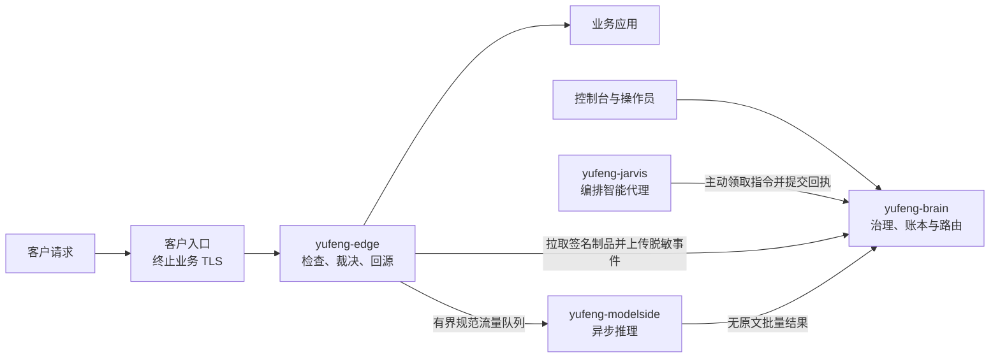

# 御锋 2.0

[](https://github.com/ZionOVO/YuFeng/actions/workflows/ci.yml)
[](https://github.com/ZionOVO/YuFeng/releases/latest)
[](go.mod)

御锋是在正式补丁尚未落地时保护企业超文本传输协议（Hypertext Transfer Protocol，HTTP）服务的安全修复系统。数据面边缘执行经过签名和回放验证的[虚拟补丁](docs/glossary.md#virtual-patch)，中台负责研判、审批、发布与审计；智能代理只能通过中台契约行动，不能直接接触业务流量。

[开始使用](docs/guides/getting-started.md) · [部署与上线](docs/operations/deployment.md) · [完整文档](docs/README.md) · [Latest Release](https://github.com/ZionOVO/YuFeng/releases/latest)

## 当前交付

| 项目 | 结论 |
|---|---|
| 当前公开版本 | 以 [Latest Release](https://github.com/ZionOVO/YuFeng/releases/latest) 为准；[`v0.1.2`](https://github.com/ZionOVO/YuFeng/releases/tag/v0.1.2) 已于 2026-08-24 公开 |
| 首个交付场景 | 单个企业站点、一个中台、一个数据面单元；客户入口终止业务传输层安全协议（Transport Layer Security，TLS），御锋处理已解密 HTTP 流量 |
| 接入方式 | 反向代理首发；已有 Envoy 或兼容网关时可使用外部授权 |
| 治理方式 | 智能代理可以提出影子策略；全量生效必须满足确定性门槛，或由提案人之外且拥有资产授权的操作员批准 |
| 上线边界 | 软件 Release 公开不等于客户现场上线完成；真实上游、代理网段、证书、切换、回退、轮换和恢复责任必须独立验收 |

## 产品工作方式



- `yufeng-brain` 保存治理事实、资源投影和审计记录；
- `yufeng-edge` 只执行已验证制品并处理当前请求，`yufeng-host` 只执行授权后的资产侧原语；
- 贾维斯与短命执行实例是中台的受认证客户端，不直连数据库、边缘、业务应用或模型端点；
- `yufeng-modelside` 是独立的 Edge 邻近进程，只做异步推理，不能拒绝当前请求；
- 策略、技能和修复程序通过签名数据制品传递，不写死在平台代码中。

完整进程边界、五种契约和信任关系以[架构设计](docs/architecture.md)为准。

## 快速入口

从源码验证基础构建：

```sh
make build test vet
```

本地纵切片演示、控制台构建和开发环境说明见[开始使用](docs/guides/getting-started.md)。企业试点必须先阅读[部署与上线](docs/operations/deployment.md)，并使用 Release 中的已校验制品；源码工作树或演示链路不能充当上线证据。

## 当前能力边界

当前不承诺以下能力：

- 御锋直接终止业务 TLS、托管站点私钥或热轮换业务证书；
- 多站点、多活中台、自动故障切换、隔离网首次安装或 Kubernetes 交付；
- 原始镜像流量采集、非 HTTP 检测、参数画像检测器或生产级主机修复执行；
- 完整的智能代理会话内审批、委派、模型上下文协议连接器桥或真实 Linux 进程沙箱。

当前实现状态见[代码地图](docs/development/code-map.md)。只有完成架构、契约、实现和验收的能力才能进入产品承诺。

## 文档与协作

- [文档中心](docs/README.md)：按产品用户、交付运维和开发者三条路线阅读；
- [开发规范](AGENTS.md)：架构、契约、测试、分支与命名规则；
- [GitHub Issues](https://github.com/ZionOVO/YuFeng/issues)：只跟踪已经明确排期的工作，不把历史设想视为产品承诺。
