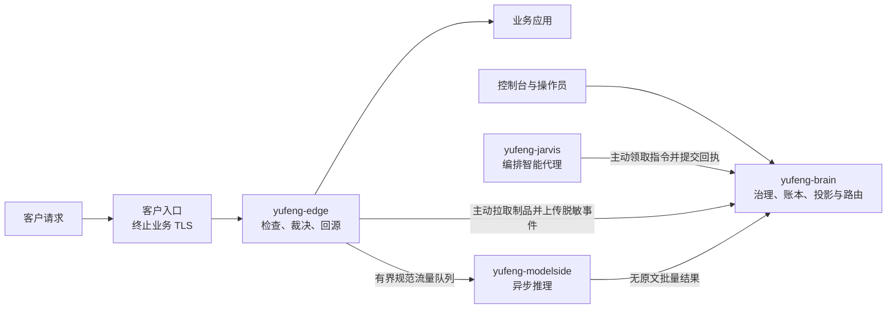

# 御锋 2.0

御锋用于在正式补丁尚未落地时保护企业的超文本传输协议（Hypertext Transfer Protocol，HTTP）服务：数据面边缘执行经过签名和回放验证的[虚拟补丁](docs/glossary.md#virtual-patch)，中台负责研判、审批、发布与审计，智能代理只能通过中台契约行动，不能直接接触业务流量。

[架构设计](docs/architecture.md) · [部署场景](docs/deployment-scenarios.md) · [交付证据](docs/delivery-evidence.md) · [开发规范](AGENTS.md)

## 当前交付状态

| 项目 | 当前结论 |
|---|---|
| 版本口径 | 仓库声明的目标版本只读取根目录 [VERSION](VERSION)；对外已发布版本只认 [GitHub Releases](https://github.com/ZionOVO/YuFeng/releases/latest) 中非草稿、与同名标签一致且证据资产完整的 Release |
| 可交付场景 | 单个企业站点、一个中台、一个数据面单元；客户入口负责业务传输层安全协议（Transport Layer Security，TLS）终止，御锋处理解密后的 HTTP 流量 |
| 接入方式 | 反向代理为首选；已有 Envoy 或兼容网关时可使用外部授权 |
| 治理方式 | 智能代理可以提出影子策略；必须由提案人之外、持有资产授权的操作员批准全量生效 |
| 实测容量 | 固定验收环境上限为每秒 2000 个请求、2048 个在途请求；更换硬件、规则集、上游或请求分布后必须重测 |
| 现场状态 | 当前目标仅为[修复连续谱 L1（虚拟补丁·流量拦截）](docs/glossary.md#repair-continuum)单站点生产试点；只有对应 GitHub Release 已公开且精确提交证据校验通过，才可宣称该软件版本和机器验收闭环；客户现场负责人仍须填写真实上游、精确代理网段、证书与网络核对结果，以及切换、回退、密钥轮换和备份恢复责任人 |

> GitHub Release 已公开也不等于客户现场已经交付。现场变更记录关闭前，不得宣称客户上线完成；版本历史、证据合同与精确发布结果见 [docs/delivery-evidence.md](docs/delivery-evidence.md)。

## 系统如何工作



- `yufeng-brain` 是唯一中台，持有治理事实、资源投影和路由决策；
- `yufeng-edge` 是数据面单元，只执行已验证制品、处理流量并上传脱敏事件；`yufeng-host` 是执行单元，只领取授权指令并逐步回执；
- 贾维斯和执行实例都是中台的受认证客户端，不直连数据库、边缘、业务应用或模型端点；ModelSide 是独立 Edge 邻近进程，只接收规范流量并向 Brain 上报无原文结果；
- 智能代理运行时已经实现可恢复认知回合、可恢复补偿、持久预算、只追加权威审计、签名工具描述与技能生命周期，以及只读调查执行实例；
- 易变的策略、计划、技能和修复程序通过签名制品传递，不写死在平台代码里。

完整进程边界、五类业务契约和信任关系见 [架构设计](docs/architecture.md)；上图只用于快速理解，不覆盖权威正文。

## 快速验证

基础检查要求 Go 1.27.0：

```sh
make build test vet
```

控制台检查使用 Node.js 22：

```sh
cd console
npm ci
npm test
npm run lint
npm run typecheck
npm run build
```

准备发布时，从冻结的 `develop` 创建 `release/vX.Y.Z`。提交前先运行定向测试和 `make build test vet`；准备推送最终候选时，对预期合并 Git 树完整运行一次竞态、漏洞与静态分析、Protocol Buffers 消息契约、控制台交付构建、跨平台编译和 Apple M4 Pro 热路径基准：

```sh
export YUFENG_EDGE_UNIT=<unit-id>
export YUFENG_MODELSIDE_ID=<modelside-id>
export YUFENG_MODELSIDE_WEIGHTS_DIR=<absolute-weights-directory>
make preflight-release-evidence
```

这三个环境设置必须在后续活栈归档中保持不变；该命令需要联网取得固定版本的检查工具和漏洞数据库。发布分支的拉取请求远端确认后只合入 `develop` 一次；`develop` 持续集成只记录最终合并提交、Git 树、父提交和已成功拉取请求，不重跑测试套件。

最终 `develop` 确认成功后，在相同环境和现有试点 Docker 数据卷上只补一次活栈、恢复和五场景性能，再与静态预检装配发布证据：

```sh
YUFENG_CI_URL=https://github.com/ZionOVO/YuFeng/actions/runs/<run-id> \
YUFENG_PREFLIGHT_MANIFEST=<preflight.json> \
YUFENG_PREFLIGHT_ARCHIVE=<preflight.tar.gz> \
YUFENG_PREFLIGHT_CHECKSUM=<preflight.tar.gz.sha256> \
make archive-live-evidence
```

归档命令先核对最终 Git 树、两个父提交、环境指纹、预检有效期和持续集成 URL，再备份源数据库并运行活栈；它不接受数据卷重置，也不重跑任何静态套件或热路径基准。输出合同见 [交付证据](docs/delivery-evidence.md)。

## 本地纵切片演示

演示只验证“普通请求放行、演示攻击被本地规则制品拒绝”的最短数据面路径，不代表企业试点交付。

先启动数据面：

```sh
make demo-init
make run
```

再从另一终端验证：

```sh
curl "http://localhost:18080/api/items?page=2"
curl "http://localhost:18080/api/items?id=1+UNION+SELECT+pw"
```

预期状态码依次为 `200` 和 `403`。`make up` 同样只是开发链路；企业试点以真实部署目标、签名监听计划和正式交付检查为准。

## 企业试点部署

| 客户入口条件 | 推荐接入 | 交付物料 |
|---|---|---|
| 可以修改域名或路由的回源地址 | 反向代理 | [接入配置与回退](deploy/reverse-proxy/README.md) |
| 已有 Envoy 或兼容外部授权网关 | 外部授权 | [固定版本配置、集成验收与回退](deploy/envoy/README.md) |

`make compose-up` 只启动生产控制面 Docker Compose 基座，不构成[人机交付闭环](docs/glossary.md#human-delivery)验收。管理员在控制台六步引导中提交部署规格后，技术人员必须按 [Edge 人工生命周期](deploy/edge/README.md)显式安装并启动 Edge 与可选 ModelSide；Brain 与贾维斯不会创建、启动、升级、卸载或探测 Edge。

部署前先用 [部署场景](docs/deployment-scenarios.md) 核对网络、TLS、规模和运维前提，再填写 [现场变更记录](deploy/pilot-change-record.md)。生产部署不得复用测试上游、宽泛代理网段、演示密钥或内置上游。

## 仓库导航

| 路径 | 职责 |
|---|---|
| `cmd/` | 八个服务与命令行程序的入口和装配 |
| `lib/` | 中台、数据面、治理内核、存储、事件总线、遥测与回放实现 |
| `agents/` | 智能代理运行时、模型客户端、工具与技能目录 |
| `components/` | Edge 邻近的独立 `yufeng-modelside` Python 服务包与镜像；不进入平台 Go 二进制 |
| `proto/` | Protocol Buffers 消息和 Connect 服务契约；生成代码随仓库提交 |
| `console/` | Vite 与 React 控制台；交付构建由中台托管在 `/app` |
| `deploy/` | 控制面 Compose、人工 Edge/ModelSide Compose、原生服务、入口参考配置、验收扩展和现场变更记录 |
| `procedures/` | 修复程序步骤模式与 HTTP 检查基线冻结物料 |
| `bpf/` | Berkeley 包过滤器能力预留；当前没有源文件或预编译对象 |
| `docs/` | 架构、接口、部署、设计、证据、术语和代码地图 |

## 文档导航

| 目的 | 文档 |
|---|---|
| 理解系统边界和技术选型 | [架构设计](docs/architecture.md) |
| 查网络行为、状态语义和接口 | [应用程序编程接口契约](docs/api.md) |
| 理解流量检查、裁决和数据面现状 | [流量拦截层设计](docs/design.md) |
| 选择接入方式并核对上线前提 | [部署场景](docs/deployment-scenarios.md) |
| 核对发布、容量、恢复与回退证据 | [交付证据](docs/delivery-evidence.md) |
| 从架构概念定位实现 | [代码地图](docs/code-map.md) |
| 查固定术语和稳定引用锚点 | [术语表](docs/glossary.md) |
| 了解开发、评审和分支规则 | [开发规范](AGENTS.md) |
| 查看客户现场收尾与条件型扩展 | [实施计划](implementation-plan.md) |

历史概念材料只有 [产品构想历史](docs/product-vision-history.md) 和 [早期概念图](docs/architecture.svg)；它们不约束当前实现。

## 当前不应宣称的能力

- 御锋直接终止业务 TLS、托管站点私钥或热轮换业务证书；
- 多站点、多活中台、自动故障切换、隔离网首次安装或 Kubernetes 交付；
- 原始镜像流量采集、非 HTTP 检测、参数画像检测器或生产级主机修复执行；
- 完整的智能代理会话控制、会话内用户审批交互、委派、模型上下文协议连接器桥或真实 Linux 沙箱。

这些能力只有在客户条件成立并完成架构、契约、实现和验收后才能进入交付范围。
