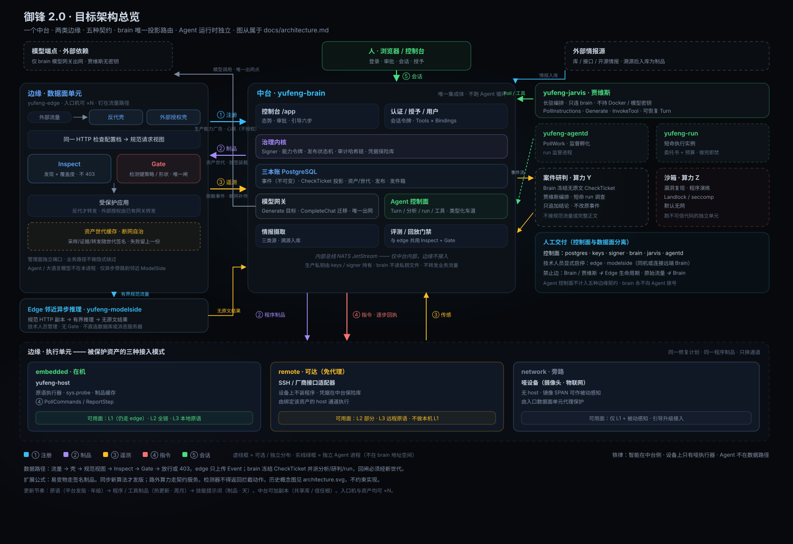

# 御锋 2.0 · 架构设计文档

> 本文是御锋 2.0 的**架构设计文档（含技术选型）**，是架构与技术选型的唯一权威文档。
> 网络行为与状态语义以 [`api.md`](api.md) 为权威，可编译的线上字段与编码以 `proto/` 为权威；两者冲突时必须阻止合入并人工对齐。
> [`product-vision-history.md`](product-vision-history.md) 与 [`architecture.svg`](architecture.svg) 为历史概念材料，**非权威、不约束实现**。本节总览图是 [`architecture-overview.svg`](architecture-overview.svg)，仍从属于正文；传输、进程边界与选型以本文和 [`api.md`](api.md) 为准。
> 参考实现（仅概念资产，代码不复用）：sentry-docker、safeshield；插件组合模式参考 DeepSeek Harness / Cordis。

---

## 0. 总纲

**一个中台、两类边缘、五种契约；Agent 运行时独立于中台。** 中台是全系统唯一的集成体——控制台、治理内核、三本账、资源投影与路由——因为只有它们共享信任根、数据真相和人机回路；贾维斯与执行 run 不是中台进程，而是与中台只通过网络契约交互的独立客户端进程。两类边缘是**数据面单元**（钉在入口，制品驱动、遥测上行、断网自治）与**执行单元**（钉在设备，指令驱动、逐步回执）。五种契约中，前四种覆盖中台与两类边缘的交互，第五种覆盖人—控制台—贾维斯会话；边缘无需与中台同物理位置，也无需中台持续在线。

**治理资源流转只有一个中枢，原始流量旁路只留在防御网络。** 边缘声明自己能生产什么并经 `UploadEvents` 上交脱敏事实；brain 校验、入账、冻结投影并选择治理消费车道。`yufeng-edge` 另把已解密 HTTP 请求副本规范化后，经独立有界队列交给邻近的 `yufeng-modelside`；后者只把类型化推理结果上报 brain，原始头、查询参数和正文不得进入 brain、贾维斯或调查 run。多资产、多站点联动仍只发生在事件账、攻击活动和新资产世代中，不形成分析器网格。

**一条铁律：智能在中台侧，但 Agent 运行时是独立进程；设备上只有哑执行器。** LLM Agent 永远不跑在被保护设备上。贾维斯可部署在中台服务器，但作为独立进程/容器运行，通过指令轮询与后端交互；执行 Agent 是独立监督进程按任务孵化的短命 run。Agent 不在数据路径上。

**一条扩展公式：数据制品承载一切易变物。** 规则、画像、提示词、工具描述、补丁程序、技能——全是签名制品，走同一条治理管道；代码面保持小而稳。

下图为目标架构总览：中台、独立 Agent 进程、两类边缘、五种契约与可选算力。**图从属于正文**；进程边界、传输与状态语义以本节和 [`api.md`](api.md) 为准。贾维斯画在中台框外。数据面按 §4.1 拆成壳、发现（Inspect）、闸（Gate）。历史概念图仍见 [`architecture.svg`](architecture.svg)。



除明确标注“当前”外，§1–§6 描述目标架构，不代表相应能力已经落地；技术项现状见 §7。流量拦截层工作设计与 2026-08 审查采纳见 [`design.md`](design.md)。数据面目标语义以本节 §4、[`design.md`](design.md) 第 4 节与 [`api.md`](api.md) 第 21 节为准；[`yufeng-edge-upgrade.md`](yufeng-edge-upgrade.md) 是愿景与文献备忘，已拍板项以本节吸收的正文为准。当前软件支持单站点[企业试点](glossary.md#enterprise-pilot)：客户入口终止业务传输层安全协议，反向代理首发，一个中台、一个拦截单元、人工批准生效。仓库目标版本只读取根目录 [`VERSION`](../VERSION)，已发布状态只读取 [GitHub Releases](https://github.com/ZionOVO/YuFeng/releases/latest)；只有同名非草稿 Release 的精确提交证据资产复核通过，才可宣称对应版本的软件发布与机器验收闭环。客户现场仍须记录真实上游、精确代理网段、证书核对、切换与回退责任人，才能宣布现场交付完成。

---

## 1. 架构判定：什么必须集成，什么必须分布

**逼着集成的三种力**：①共享信任根（签发/验证/授权不可委托，否则被委托者自己成了信任根）；②共享数据真相（事件/资产/制品三本账——审计哈希链贯穿——必须事务一致）；③人机回路（审批、对话、会话状态，延迟对象是人）。
**逼着分布的一种力（不可抗）**：④数据路径——流量拦截必须发生在入口。
**组织原则**：⑤故障域隔离——中台死掉，边缘必须继续执行。

| 组件 | 判定 | 决定性理由 |
|---|---|---|
| 控制台 / 治理内核 / 三本账（PostgreSQL） | **中台**（唯一集成体） | ①②③全占 |
| 贾维斯 / Agent 监督进程（yufeng-jarvis / yufeng-agentd） | **独立进程，可与 brain 同机** | 故障隔离 + 禁止把智能运行时嵌进信任根；只经 Agent 控制面 API 交互 |
| 情报摄取、评测/回放门禁 | 中台默认附着 | 只是账本读写者；算力重时可外移 |
| Agent 运行时（执行 run） | 独立进程，由 yufeng-agentd 监督孵化 | 智能属于中台侧；不可逆动作回治理审批；run 只持本地监督代理连接，网络凭证与能力令牌由 agentd 代持 |
| 同步检测（核心规则集/画像）+ 闸 | **边缘 · 数据面单元** | ④：钉在入口，微秒档进程内；Python 模型不在此列 |
| yufeng-host | **边缘 · 执行单元** | ④⑤：在机执行、传感、断网兜底 |
| yufeng-modelside | **独立分布 · 边缘亲和算力** | 在已解密流量入口附近异步推理；从 edge 接收版本化规范流量，只向 brain 上报无原文结果，不持 Gate 权限 |
| 沙箱 / 脱敏调查 run | **独立分布 · 中台亲和算力** | 隔离执行不可信代码或消费脱敏投影；只经 agentd 受监督，不得接收原始流量 |
| 外部情报源（库/接口/开源情报 OSINT）、模型端点 | **外部依赖** | 情报经溯源治理入库为制品；模型只经 brain [模型网关](glossary.md#modelgateway)出网（现有纯文本 `CompleteChat` 见 `docs/api.md` 第 19.4 节，统一座架 `Generate` 见第 18.10 节）。`agents/modelgateway` 客户端库不是生产出口 |

中台可增加多个共享 PostgreSQL 与信任根的副本，概念上仍是一个集成体；入口机与被保护资产也可横向扩展。

---

## 2. 五种契约（全部耦合面）

**边缘（入口机/设备）只说 HTTP（Connect / gRPC，均为远程调用协议）；NATS（消息服务器）只是 brain 地址空间内或中台受控域内的投递实现，边缘、modelside 与远端 worker 都不直接接入。** `yufeng-edge → yufeng-modelside` 是数据面内部的原始流量旁路，`yufeng-modelside → yufeng-brain` 是专用类型化结果上报；二者不增加中台—两类边缘的业务契约类别。短命调查 run 只消费 Brain 冻结的脱敏投影。Agent 控制面是服务族：`SessionService` 实现第五种人—控制台—贾维斯会话契约；`AgentControlService`、`RunService`、`WorkerService` 与 `ToolGatewayService` 承载指令轮询、run 工作项和工具调用，不计入五种边缘契约。

**计数关系一句话**（三个口径勿混）：**五种网络契约** = 前四种中台—边缘交互 + 第五种人—控制台—贾维斯会话（本节表格）；**六个数据契约** = `proto/` 里的六个治理数据消息（事件 / 资产 / 制品 / 修复计划 / 修复程序 / 工具描述）；**进程内数据面接口** = [Inspector](glossary.md#inspector) + [Gate](glossary.md#gate)（均不进 `proto/`）+ 能力令牌声明（Go 结构体）。资产世代是制品契约上的原子装载信封，不是第七个治理数据契约；检查票据是事件的脱敏投影。规范化模型流量与模型结果是 Edge 内部旁路线缆，不改变治理契约计数。仓库已有 Inspector 与 Gate 活路径、中台单点不可变票据投影、Edge 邻近模型旁路、可恢复认知账本、统一模型生成记录、执行实例持久预算与补偿事务、只追加权威审计、签名工具与技能生命周期，以及消费冻结票据的只读调查执行实例。

| # | 契约 | 方向 | 语义 | 失败行为 |
|---|---|---|---|---|
| ① | 注册 | 单元 → 中台 | 单元身份、资产绑定、能力矩阵（sys.probe）、心跳、版本协商 | 心跳丢失 → degraded，保留单元与资产记录 |
| ② | 制品 | 中台 → 单元 | 两条独立的签名流：资产世代承载检测与裁决成员；单元监听计划承载入口姿态、流量键、监听地址与回源约束。两者均版本化、可缓存，不得相互嵌套 | 断网 → 分别使用上一份已验证可用世代和监听计划 |
| ③ | 遥测 | 单元 → 中台 | 脱敏检测事件与资产侧传感事件，异步批量；进程日志、`/metrics` 与注册心跳分别进入可观测域和注册域 | 断网 → 本地有界堆积，恢复补传 |
| ④ | 指令 | 中台 → 执行单元 | 程序调用：每步回执、可中止、超时即弃 | 回执断流 → 视为失败，进回滚分支 |
| ⑤ | 会话 | 人 ↔ 控制台 ↔ 贾维斯 | 长轮询 + 持久队列 + 租约；即时通讯、邮件只作旁路送达，不是会话传输 | — |

"在入口做配置把流量引到检测"走②——配置内容是制品，不是控制台远程改机器。

"五种契约"是业务耦合类别，不是远程过程调用或服务数量上限。新增 modelside 原始流量接收与结果上报服务不改变这个计数；反过来，让 modelside 直连 NATS、PostgreSQL、贾维斯，或把原始流量塞进事件、检查票据或 run 的 `PollWork`，都会破坏既有边界。

---

## 3. 中台（`yufeng-brain`）

- **控制台（目标形态）**：登录、态势、案件工作台、Agent 管理、事件与审计追溯、系统设置；静态单页应用（SPA）由 brain 托管在 `/app`，单页路由回退到 `/app/index.html`。侧栏按“防护配置 / 记录追溯 / 系统设置”折叠分组；资产、Agent 管理与防护策略同属防护配置，事件与审计同属记录追溯，用户与模型网关同属系统设置。交付静态包只包含正式路由，禁止编入设计回廊、固定指标、演示账户或本地业务状态机；会话里的案件与审批附件只携带引用，控制台必须重新读取当前案件、资产和审批状态。人机交付闭环把托管与同源调用列为硬门禁；[Connect-ES](glossary.md#connect-es)（Connect 协议的 TypeScript 客户端生成与运行库）不是本档必交项，手写 Connect JSON 过渡层可交付。
- **初次配置引导**：库中一行引导状态；管理员登录未到 `ONBOARDING_STATE_COMPLETED` 不得进主控制台。契约见 [glossary.md](glossary.md#onboarding) 与 `docs/api.md` §19。
- **Agent 与工作控制面**：Agent 指令队列、run 工作队列、租约、Agent/worker 分 audience 身份、能力令牌签发与记账、工具调用网关、会话队列。brain 只负责排队、授权、投影与审计，**不运行 Agent 循环或流量分析模型**；生产大语言模型补全与连通性探测由 brain 内的[模型网关](glossary.md#modelgateway)发出，贾维斯不持密钥。
- **受管短命 Agent**：控制台可以创建、停用、编辑和删除非贾维斯的[受管短命 Agent](glossary.md#managed-agent-profile)。Agent 是带稳定 `agent_id`、工具、资产范围和配置摘要的业务主体，但不是常驻网络进程；Jarvis 只编排案件，`agentd` 为每个案件启动绑定该 Agent 冻结配置的 `yufeng-run`。模型、工具、结论、run 与审计均归属该 Agent，不能归属或回落到 Jarvis。删除采用墓碑语义：禁止新委派，已分派案件按冻结快照结束。
- **治理内核**：制品签名经 `Signer` 接口（Ed25519，门禁通过后按全信封计算制品身份；生产私钥由密钥管理服务、公钥密码标准 11 或独立套接字持有，brain 进程不读私钥文件；签名端只收已通过确定性校验的类型化对象，不接自然语言、任意 JSON 或任意字节）、能力令牌签发与预算记账、治理管道状态机（口语 draft→signed→shadow→canary→enforce→retired，线上键必须是 `RELEASE_STATE_*`；仅精确检测键策略门槛自动推进，无人审 pending；单单元禁止 canary，人手可从 shadow 直达 enforce）、审计哈希链与外部签名检查点。首版不保存远程登录或厂商接口凭据。逻辑上仍是一个中台；第一生产版不拆成 api / authority / signer 三个部署单元。生产中台在同一进程内持有治理池和流量池两个数据库连接池：流量池必须使用独立 `yufeng_traffic` 登录角色，且启动时由 `ValidateRestrictedTrafficRole` 验证 `NOINHERIT`、无高权限角色属性、只对 `traffic` schema 的规定表拥有 `SELECT` / `INSERT`，并且不能访问治理表。该数据库角色隔离是已经落地的纵深防御，不等于进程、地址空间或整个中台信任计算基已经拆分；Agent 工具网关仍不能直接更新发布状态。
- **三本账 PostgreSQL 16 + pgvector**：事件账（不可变）· 资产账（units/assets/unit_assets 关系）· 发布账（release 生命周期 + 签名制品内容寻址 + 资产世代），审计哈希链贯穿三者。入账与内部流投递必须走事务发件箱，禁止「数据库已提交、消息永久丢失」。
- **资源投影与路由**：brain 是治理对象的唯一派发者。它从已接受事件和该事件钉死的历史资产世代构造不可变检查票据，按事件种类与签名策略选择“不派发 / 调查 run / 贾维斯研判”；modelside 的原始流量输入不经过此投影。模型结果到达后，brain 复核结果所引用的签名模型档案，再幂等创建事件、推理记录、票据、案件与事务发件箱。路由策略只表达用途和车道，不写具体消费者标识，也不授予可见性。
- **Agent 运行时**：不在 brain 进程内。`yufeng-jarvis` 是长驻编排进程；`yufeng-agentd` 是 run 监督进程，负责从 brain 拉取工作项并孵化短命 `yufeng-run`。调查 run 的输入是 brain 冻结的完整检查票据与摘要，只经工作项和已连接的本地监督套接字传给子进程；它只持字段级只读工具，所有终态由 brain 绑定票据写持久回执。
- **中台 worker**：情报摄取（外部三类源：库/数据集、API/接口、OSINT——溯源治理后入库为情报制品）、评测/回放门禁。
- **模型网关**：大语言模型唯一出网口，挂在 **brain 进程内**（[定义](glossary.md#modelgateway)）。生产默认 `base_url=https://api.x.ai/v1`、方言 `MODEL_DIALECT_OPENAI_CHAT`、`model` 缺省 `DefaultChatModel`（引导里可改）；密钥只存在中台凭据槽。同时一条槽。出网按槽上的[模型方言](glossary.md#model-dialect)转发 OpenAI Chat、OpenAI Responses 或 Claude Messages（`docs/api.md` §19.4）。引导完成后管理员可在控制台 `/app/model` 改槽并看窗内成功率，不退引导状态。确定性模型剧本只存在于测试编译单元，不进入交付二进制；`-dev-insecure` 只放宽本地传输，不启用固定回答。贾维斯生产**禁止** `-model-url` 旗标（含指向 brain 或内网）。流量深度学习不经过本模型网关，也不在 brain 进程执行；生产贾维斯走带账本、租约与 ModelAttempt 的 `Generate`，`CompleteChat` 只保留迁移兼容和槽连通性探测（`docs/api.md` §18.10）。Google Agent Development Kit 只借形状，不进进程（ADR-003 / ADR-026）。
- **内部总线 NATS JetStream**：内嵌于 brain；域档外置集群。
- **Edge 生命周期**：`yufeng-edge` 的安装、启动、升级、回退与卸载只由技术人员操作。brain 在管理员提交部署规格时确定性预建资产并签发监听计划、基线世代和模型档案，但不创建进程、容器或主机服务，也不拨号探测 Edge；Edge 启动后主动注册、拉取并在心跳中报告已装载版本。贾维斯只做安全研判和治理建议，不获得 Docker、服务管理、Edge 安装或管理口探测权限。正式交付不包含自动创建 Edge 的数据面监督进程。
- **交付拓扑（架构决策记录 036）**：`deploy/compose.yaml` 只交付控制面的 `postgres`、一次性 `traffic-role`、`keys`、`signer`、`brain`、`jarvis` 与 `agentd`；技术人员可以把独立 `deploy/compose.edge-modelside.yaml` 合并到同一 Compose 项目显式启用 `edge` 与 `modelside`，也可以把二者作为原生进程、独立容器或独立主机连接远端 brain。`yufeng-edge` 同时交付原生 Go 二进制和独立容器镜像；`yufeng-modelside` 同时交付原生 Python 服务包和容器镜像。Compose 只声明期望进程，不把其生命周期授权给 brain 或 Agent。`keys` 只幂等生成正式制品签发密钥与传输层安全材料，不生成演示规则；`traffic-role` 只幂等创建 `yufeng_traffic` 受限登录角色并退出。Edge 与 modelside 同机优先使用 Unix 域套接字，跨主机必须使用双向传输层安全协议并限制在同一受控防御网络。不做 Kubernetes。

---

## 4. 边缘

### 4.1 数据面单元（`yufeng-edge`，入口机，可多台）

入口上只放哑的、可回放的、制品驱动的核。贵的、会思考的、会扩展的东西全部站在中台一侧，经契约看见脱敏投影。部署形态是壳，发布状态是闸，检测方法是眼睛——三件事不要焊成一根旗标。

**壳（入口姿态）** 闭集四项：反代拦截、外部授权拦截（Envoy 外部授权协议）、侧载只告警、镜像或交换机端口镜像（SPAN）只观察。四种壳必须先按 HTTP 检查配置档变成同一[规范请求视图](glossary.md#canonical-request-view)，再进入边缘核。姿态编进已签名的[单元监听计划](glossary.md#unit-listen-plan)，**不**编进资产世代。单元以自己的身份调用 `ArtifactService.ListUnitListenPlans`，只拉严格大于本地版本的计划；验签、目标 `unit_id`、单调版本和全部约束通过后才原子替换并开放业务监听。一台机可以「反代 + 侧载」并存、拉同一世代。同一流量键不得两个拦截单元；一个单元标识不得两种壳。御锋自身的健康检查与指标走独立监听端口，业务路径不做隐式策略绕过。

**首个企业试点的传输边界**：客户已有入口终止业务传输层安全协议（Transport Layer Security，TLS），御锋只接收已解密的超文本传输协议（Hypertext Transfer Protocol，HTTP）。业务证书与私钥属于客户入口，不进御锋配置、制品、账本或控制面传输 TLS 参数。反向代理是必交首发姿态；Envoy 外部授权是可选兼容姿态。未解密的 TLS 流量不得冒充 HTTP 检查，HTTP 检查面为 `UNSUPPORTED`。

**客户端来源**不进规范请求视图和检测键，只作检测元数据与假名审计索引。默认取直接对端；只有直接对端命中已签名监听计划的可信无类别域间路由（Classless Inter-Domain Routing，CIDR）网段时，边缘才从右向左解析 `X-Forwarded-For`；任一地址非法则整个头失效并回退直接对端。首个试点不接 PROXY protocol。原始地址只在边缘请求内存中短暂存在；上行前用部署作用域秘密生成来源假名，不写日志、事件原文或模型投影。

**发现（Inspect）** 与 **闸（Gate）** 分离。同步口是进程内 [Inspector](glossary.md#inspector)：只出完整检测键与每面检查覆盖度，**不**返回拦截动作。接口刻意不进 proto。`Action` 只属于 [Gate](glossary.md#gate)。回放硬保证：同一规范请求视图 + 同一客户端来源元数据 + 同一 `activeGeneration` + 同一入口姿态 + 同一 `unit_id` ⇒ 同一发现集 + 同一每面覆盖度 + 同一闸门动作。活路径是 `Inspector.Inspect` + `Gate`：世代清单选装眼睛，监听计划决定入口姿态与绑定，与发布状态拆开。

**五层眼睛**见[检测器档位](glossary.md#detector-tiers)。同步层：Coraza 核心规则集（永远 DetectionOnly）+ 可选纯 Go 画像核（后接，未装载则清单里没有）。异步深度学习由邻近的 `yufeng-modelside` 执行：Edge 从反向代理、外部授权或已解密流量复制入口取得真实 HTTP 请求，形成版本化[规范化模型流量](glossary.md#normalized-model-traffic)，在同步 Inspect + Gate 完成后把正文缓冲的一次有界所有权交给非阻塞队列。队列满、modelside 空闲或满载、brain 断连、磁盘变慢都不得改变当前请求；满时丢旁路并计数。modelside 不进 Edge 二进制、不持 Gate 权限，结果只能影响后续案件与新世代。调查执行实例由 brain 创建，短命、窄权，不回改本次请求。hold-and-forward 默认永不做。

**403** 只允许四件事同时成立：入口姿态允许拦截 ∧ 发布状态允许 block ∧ 策略或形状为 block ∧ 检查覆盖度满足要求。观察壳永远缺第一项，硬闸不得 403。`blocks_total` 只计真 403。自动晋升只数拦截单元。观察单元必须装完整世代，才能产出 `would_have_blocked`。覆盖度不足时的状态码见 [`api.md`](api.md) 第 21.2 节矩阵：反代拦截超体 413、畸形 400；外部授权拦截这两类写网关 403（Envoy DENIED）。不当 503，不当「无发现放行」。

**世代**是「这台资产跑哪些眼睛和闸、生产多少样本、保留什么摘要、进入哪条逻辑车道」：验签、检查单调序号与依赖摘要、编译成功后原子替换；enforce 依赖失败则保留上一份已验证可用世代。成员含检测器清单、检查配置档、策略、形状、分类映射器、[采样策略](glossary.md#sampling-policy)、[证据策略](glossary.md#evidence-policy)（默认 `home`）、[证据摘要](glossary.md#evidence-digest)、[转发策略](glossary.md#forward-policy)。换采样、摘要或路由语义 = 新世代；换摘要算法还必须重回放。

**侧载灰故障**：监听计划签不了「网关真的把流量拷过来了」。连续两个心跳无请求而同键拦截单元在跑 → 资产健康 `tap_silent`；已声明跟随关系的观察流与拦截流方法×路由模板 Top-N 集合 Jaccard < 0.5 且双方请求数都 ≥ 100 → `tap_skew`；镜像单元 `body_full_rate` 长期为 0 却报 HTTP `FULL` → 该面强制 `UNSUPPORTED`。控制台必须写「执行面可能看不见」。

**过载早丢**：同步 Inspect+Gate → 契约③关键事件的内存交接 → modelside 旁路 / 采样。请求路径禁止推理、访问 brain、同步写文件或等待旁路消费者。同步超 `EdgeInFlight` 对新连接 503；遥测或 modelside 队列满时只丢对应异步副本并计数。证据环有条数与字节上限，持久化只在后台发生。

**生产能力不是授权。** 注册与心跳携带结构化能力广告，只描述该单元客观上能产生的关键事件、普通样本、票据特征、投影版本、入口姿态、传感类型、编译进二进制的模块协议能力和容量上限；生产健康另报缓冲与丢弃计数。brain 持久化后在世代下发前做兼容性检查，并用模块协议能力决定编译期模块目录是否激活，不兼容整代拒绝。资产标签与中台策略参与编译下一份签名世代，决定实际采样、证据和转发行为。能力广告不能改变资产绑定、Tools、Bindings、发布范围或消费者可见性。支持 `TrafficReviewPolicy` 的 Edge 使用签名模式运行完整统计与有界代表；`NoDetectionSampleRate` 仅供旧 Edge 兼容，禁止读取实时可变标签直接改变边缘行为。

- canary 默认按单元标识稳定分片，禁止用单次请求随机标识分桶。
- 遥测 NDJSON（逐行 JSON 日志）+ 三层脱敏。事件账默认无原文。检查票据是 brain 冻结的完整脱敏工作投影，不是第七个数据契约。
- **断网自治**：本地已验证世代继续拦截，遥测有界堆积恢复补传；modelside 可继续本地推理，其独立结果队列满时丢结果并计数。自升级仅接受验签制品。中台或内部流中断不得回退到未验证混合状态。
- **对 brain 透明**：新增一种检测方法时，治理状态机、三本账表形状、贾维斯循环、研判入队谓词、提案意图编译器、蒸馏解释函数，零处出现新的检测器标识分支。不透明的是信封：检测键、覆盖度、清单摘要、策略/形状、研判原因。

### 4.2 执行单元（`yufeng-host`，Linux/OpenWrt 本机最小面）

正式交付的 `yufeng-host` 只在安装了非特权宿主程序的 Linux/OpenWrt 资产上运行。资产契约保留旧接入模式枚举用于兼容历史消息，但 `remote`、安全外壳协议、厂商接口和 `network` 执行不进入能力广告、命令派发或正式文档承诺；旁路设备仍只能由 `yufeng-edge` 提供第一层流量保护。

- 原语闭集：`sys.probe`、`artifact.stage`、`file.atomic_replace`、`service.reload`、`verify.file_digest`、`verify.service_active`；未知原语一律失败关闭。
- 目标目录、服务名和制品验签公钥来自本机 `0600` 配置；禁止 shell、任意命令、任意统一资源定位符和包升级。
- 每个命令在副作用前同步落盘意图和补偿材料。重载失败时恢复原文件并再次重载；重启发现已跨越副作用边界但没有结算时进入 `OUTCOME_UNKNOWN`，不得自动重放。
- systemd 与 procd 只调用固定可执行文件和固定参数，不经 shell；路径打开使用限制在允许根目录内的操作，拒绝路径穿越和符号链接逃逸。

### 4.3 独立分布 · 边缘亲和与中台亲和算力（可选）

- **`yufeng-modelside`（边缘亲和算力 Y）**：独立 Python 服务进程，参考 sentry-docker ModelSide 的 TensorFlow 模型形状、字符编码、分组权重加载和批量推理，但不复用其日志接入、Redis、消费者或结果上报代码。它接收 Edge 已验证世代导出的[签名模型档案](glossary.md#signed-model-profile)和版本化规范流量，按档案中的模型版本、告警阈值、复核下限、窗口、单元/路由上限与去重规则推理和采样；任何值都不得由进程硬编码为运行策略。它不进平台 Go 二进制、不持 Gate 权限、不训练、不接 NATS 或 PostgreSQL。
- **两个独立队列**：Edge 的输入队列只负责 `edge → modelside`，modelside 的结果队列只负责 `modelside → brain`。输入队列满时丢流量旁路；结果队列满时丢结果旁路；二者分别计数且互不施加背压。`MODEL_ALERT` 达到签名告警阈值后全量尝试进入结果队列；`REVIEW_SAMPLE` 只在达到复核下限、新路由或覆盖不足等签名条件时进入窗口化有界代表集，同方法与路由默认只保留最高风险代表。brain 断连不能停止本地推理。
- **传输边界**：同机 Edge 与 modelside 优先使用权限受限的 Unix 域套接字；跨主机使用双向传输层安全协议，双方证书身份必须匹配允许的 Edge/modelside 工作负载，并只部署在同一受控防御网络。modelside 上报只含请求标识、归属、世代、方法、路由、覆盖度、分数、模型坐标、档案摘要和采样原因；不得包含原始头、查询参数或正文。
- **沙箱（中台亲和算力 Z）**：漏洞验证代码（PoC）复现、提取利用行为签名、程序制品沙箱演练（发布前门禁）；Landlock/seccomp 隔离、默认无网——跑不可信代码的地方必须是独立单元。

### 4.4 资源流转与三条消费车道

边缘能生产什么、谁有资格看见、贾维斯碰哪一层，是三条相互独立的轴：

| 轴 | 权威来源 | 不得发生 |
|---|---|---|
| 生产能力 | 单元注册能力广告 + 心跳健康；只描述事件、传感、投影版本和容量 | 自报能力直接授予工具、Bindings 或证据权限 |
| 采样与派发 | 已签名资产世代中的采样、证据、摘要、转发策略与模型档案；Edge 只连接技术人员配置的本地 modelside 端点，brain 解析历史世代 | 世代写具体进程标识；modelside 自定阈值或采样上限 |
| 消费资格 | worker/Agent 的服务端档案、授予 Tools × Bindings、用途和租约 | 请求自报 Bindings；分析器之间转发；按网络位置默认信任 |

资源按风险分流：

| 资源 | 流转语义 | 消费者 |
|---|---|---|
| 流量统计窗 | 关键流量完整计数；普通流量按五分钟窗聚合方法、路由、覆盖度和处置结果，前 32 个组合之外并入 `other` | 容量、趋势、聚类基线和离线评测；不直接叫醒 Agent |
| 审查候选 | 单元按已签名 `TrafficReviewPolicy` 每窗最多冻结四个风险与多样性代表；候选才进入事件账和检查票据 | 聚类、控制台、确定性协调器；满足条件后形成资产案件 |
| 检查票据 | brain 从已接受事件或模型结果与钉死世代冻结的字段级脱敏投影；不是原始流量上行资源 | 贾维斯与调查 run，按用途分别裁剪 |
| 规范化模型流量 | Edge 从已解密 HTTP 请求副本构造；正文只向本地模型旁路转移一次有界所有权 | yufeng-modelside；禁止进入 brain、事件账、检查票据或 Agent |
| 模型结果 | modelside 按签名档案分类为 `MODEL_ALERT` 或 `REVIEW_SAMPLE`，经专用批量协议上报 | brain 幂等入账、案件聚合；只有告警创建或唤醒研判 |
| 原始证据 | 只留产生单元的加密、有界短期证据库；中台账本只存句柄、摘要和过期时间 | 人可本地取证；绑定资产的一次性审批可让短命调查 run 经 brain 敏感中继调用现有模型网关，贾维斯始终不可见原文 |
| 进程日志、指标、心跳 | 走可观测与注册域；可由确定性规则形成运维告警 | 运维面；不作为贾维斯日志流，不进入检测键或模型提示词 |

三条消费车道不得混装：

| 车道 | 调度 | 输入与产出 | 权限模型 |
|---|---|---|---|
| 邻近模型打分 | Edge 输入服务 + brain 批量结果服务 | `NormalizedTraffic → MODEL_ALERT / REVIEW_SAMPLE`；只影响后续治理、永不 403 | Edge/modelside 工作负载身份 + 签名模型档案；无 run 工具集和 Agent 能力令牌 |
| 贾维斯研判 | `AgentControlService.PollInstructions` 的 `EVENT_TRIAGE` | 聚类研判投影 → `TriageDecision` / `triage.complete` | 指令双令牌；只读投影工具，无原始事件与治理写 |
| 调查与执行 | `WorkerService.PollWork` 领取 run 工作项 | 调查、Procedure/Saga、验证与补偿 | agentd 代持工作项能力令牌；run 只连本地监督代理 |

检查票据必须由 brain 在事件或模型告警入账事务中确定性冻结，并与事件行和事务发件箱一同提交；投影算法、证据摘要和模型档案来自结果引用的历史世代。历史世代或投影材料缺失时整条模型结果失败关闭，禁止退回固定阈值、固定摘要算法或 `{event_id}` 拉取。原始规范化流量不是检查票据，也不得据此在 brain 重建请求正文。

跨站点联动只走账本：A、B 两站事件进入同一攻击活动，brain 再为各资产编译新世代或创建研判/调查任务。站点 worker、边缘和分析器之间不得订阅彼此或复制全量日志。

流量审查以[调查案件](glossary.md#investigation-case)为 Agent 工作单位，不把日志流直接交给模型。brain 在叫醒贾维斯前按资产、聚类、风险、覆盖缺口、路由新颖度和近期反馈选出最多五个代表，其中最多三个高风险样本、两个基线对照。默认部署每天最多创建 200 个模型调查，每资产最多 24 个；达到预算后案件继续入账但不调用模型。

---

## 5. Agent 体系

### 5.1 统一 Agent 模型

**Agent 只有一种认知循环与工具语义，贾维斯和认知型 run 不复制两套座架。** 区别是生命周期、调度队列和中台签发的权限（Role / Tools / Scopes / Bindings / MaxCalls）。代码面不设 `agents/jarvis` 独立包：`agents/runtime` 是统一 Agent 运行时，`yufeng-jarvis` / `yufeng-agentd` / `yufeng-run` 三个进程入口只做装配。网络身份并不相同：贾维斯自己连 brain；run 只连 agentd 的本地监督代理，由 agentd 代持网络凭证。

- **贾维斯（orchestrator）**：独立进程 `yufeng-jarvis`。长驻循环：`PollInstructions` 只拉取会话消息、事件通知与安全研判任务；思考所需的模型生成向 **brain 模型网关**请求 `Generate`，再通过工具网关调用安全研判与治理建议工具。贾维斯不接收基础设施部署指令，也不持 Docker、进程管理、Edge 安装、基线签发或 Edge 探测权限。Agent 要求人审时调用 `approval.request`，不能把请求伪装成 brain → Agent 的 `APPROVAL_REQUEST` 指令。重启不丢处理进度——指令与认知账本持久化在 brain，租约到期可恢复。引导完成前令牌不得含生产治理写工具。
- **Agent 监督进程**：`yufeng-agentd` 独立进程。它以证书绑定的 `RUN_SUPERVISOR` 工作负载身份调用 `PollWork`，把轮换刷新令牌原子保存到独占状态目录，独占访问令牌、客户端证书和工作项能力令牌，在自己的进程空间孵化短命 `yufeng-run`，并提供绑定 `work_id` 的本地监督代理。agentd 可并行保持最多四个本地领取槽，Brain 在每次领取的数据库事务内以 worker 当前批准的 `max_concurrency` 作最终门禁，客户端并发不扩大授权。Linux 与 macOS 使用本地套接字和进程组，Windows 使用命名管道与作业对象；监督进程死亡必须回收完整子进程树。
- **执行 Agent（run）**：`yufeng-run` 是被 agentd 孵化的一次性进程：委托书（修复计划/程序引用+目标+约束）+ 工具包 + 预算 + 存活时限，做完即焚。run 只继承已连接的本地进程间通信通道、`work_id` 与一次性随机数，不持访问令牌、刷新令牌、客户端证书或能力令牌，也不建立网络连接。只读调查也必须满足对应平台完整沙箱门禁：Linux 与 macOS 已实现相应适配；Windows 已实现命名管道、受限令牌和作业对象，但 AppContainer（应用容器）未完成可验证适配前不得领取流量调查。危险执行仍只允许满足 Linux 强沙箱门禁的 worker。程序中途失败由 run 内操作员角色分析上报；**不可逆动作永远回治理审批**。

### 5.2 自治分级（能力令牌为执行载体）

| 级 | 动作 | 授权 |
|---|---|---|
| T0 | 报告、只读 | 自动 |
| T1/T2 | 可逆修复（L1/L2，短存活时限，shadow 先行） | 自动，秒级可回滚。L1 还须同时满足 `scope_risk ∈ {exact, route}`、合格证据类与回放覆盖度；形状、未映射、模型与宽范围仍须另一用户 `promote_*`。这不是新的审批产品 |
| L3 | 冷补丁（直接修复业务，可含重启） | **永远人审**（先报告后授权） |

`scope_risk` 只描述铺开半径；自动晋升还要看证据类与回放覆盖度。它与本表自治分级不是同一轴，定义见 [glossary.md](glossary.md#scope-risk)。

### 5.3 会话日志铁律

任何到达模型的内容必须可从只追加日志与 `ContextManifest` 重建；模型摘要只是可丢弃投影，不能成为检测键、资产世代、修复计划、审批、工具回执、预算或回滚的权威来源。认知对象固定为：

```text
AgentThread
  └─ AgentTurn
      └─ AgentStep
          ├─ AgentItem
          └─ ModelGeneration
              └─ ModelAttempt
```

- `AgentThread` 钉死长期来源：用户 `session_id`、研判 `cluster_id` 或认知型 `run_id`；`AgentTurn` 钉死本次输入游标：`message_sequence`、`cluster_version/event_cutoff` 或 `work_id + plan_digest`。恢复不得读取“当前最新”代替已钉死游标。
- 贾维斯 Turn 复用 `agent_instructions`，认知型或程序型 run 复用 `work_items`；不建第四条长轮询队列。AgentItem、ModelAttempt、工具意图和结算只进账本，不对账本 Poll。
- 执行历史按 `item_sequence` 条件追加；steering、follow-up 与用户回答进入独立 `input_sequence`，只在安全 checkpoint 物化为 AgentItem。用户并发输入不推进执行序号，不能撞掉正在返回的模型响应。
- `lease_epoch` 是所有权隔离栅栏：初次领取和释放后的重新领取才递增；同一持有者正常续租保持 `lease_id` / `lease_epoch`，只延长到期时间。旧 epoch 的账本写、模型生成和工具调用全部失败关闭。
- Turn 等待子 run、审批或用户输入时，同一事务落 checkpoint、释放租约并吊销该租约能力令牌；事件落定后唤醒原 instruction / work item，不另发“恢复指令”。终态为完成、失败、取消或结果未知；外部副作用已开始但无法判定时只能进入结果未知，禁止自动重跑成成功。

### 5.4 Agent 身份、唯一对等体与攻击面

- **四类凭证与预算账户**：bootstrap_token 是绑定精确 Agent 身份或 `worker_id + worker_kind + 公钥/证书指纹` 的一次性注册凭证；refresh_token 是服务端仅存哈希、低频使用且每次轮换的长期续期凭证；access_token 是轮询、查询与回执使用的短期身份凭证；capability_token 是每个 instruction 或 run work item 独立签发的短期最小权限凭证。Agent access、run workload access 与 ModelSide workload access 使用不同 audience；ModelSide 没有业务能力令牌，只能上报签名档案约束的类型化结果。能力令牌的 `jti` 只标识令牌实例和吊销状态；权威额度在持久 `budget_id` 账户中。换令牌、正常续租、等待后恢复均不得重置预算。
- **控制面唯一网络对等体是中台**：贾维斯与 agentd 无论部署在中台旁还是防御局域网，控制面只允许连 `yufeng-brain`。`yufeng-run` 没有网络对等体，只使用 agentd 的本地监督进程间通信（IPC）；这不是第二个网络对等体。禁止 Agent 对用户、即时通讯、邮件、公网模型端点、被保护资产、PostgreSQL、NATS、边缘、Docker 套接字、主机防火墙直连。ModelSide 只接收 Edge 的本地数据面旁路并主动上报 Brain，不连接 NATS、PostgreSQL、Agent 或其它 ModelSide。人说话只进控制台；中台决定是否签发指令。用户原文不是命令，最多作为已签发指令的附件数据。模型密钥只存在中台；正式座架生成必须调 `Generate`（`docs/api.md` §18.10），`CompleteChat` 只保留迁移与连通性探测，贾维斯仍**禁止** `-model-url` 旗标。
- **传输与「中台不连 Agent」**：brain **永不**向 Agent 或 worker 拨号或反向 RPC。双向 TLS（双方证书校验）加在 **Agent/worker 发起的** HTTPS 连接上：一边是 brain 服务器证书，一边是已登记公钥对应的客户端证书。命令走长轮询**响应体**；可用同一把注册公钥加密信封，使只有目标身份能打开。证书不对则本次接入失败，不是 brain 改去找调用方。
- **领取只认令牌主体**：`PollInstructions` / `AckInstruction` / `PollWork` / `CompleteWork` 以访问令牌 `sub` 为准，请求里的 `agent_id` / `worker_id` 不作授权。租约释放后重新领取必须换 `lease_id`、增加 `lease_epoch` 并吊销旧能力令牌；正常续租不改变所有权 epoch，也不得立即打断同一 epoch 已在途的合法调用。
- **工作项不是匿名抢单**：领取条件是工作项 Bindings ⊆ worker 档案 Bindings（子集，不是相交）；档案 Bindings 为空或缺项则不能领。不另建选人队列产品。
- **双令牌承载**：ToolGateway 同时使用 `Authorization: Bearer <access_token>` 与 `X-Yufeng-Capability: Bearer <capability_token>`，并要求访问令牌 `sub` 等于能力令牌 `azp`。Scopes 不得单独授予 Tools 里没有的写动作。生产研判 Agent 只交 `triage.complete`；操作域用户或确定性协调器进入治理内核的 ProposalIntent 必须硬拒无 `intent` 的 `KIND_RULE` / `rules/v1`。
- **威胁与对策**见 docs/api.md §18.9。原则：凭证失窃靠短时 + 注册公钥绑定 + 吊销；重放靠双令牌、`lease_epoch`、持久 `budget_id` 与业务调用标识；提示词注入靠「外界无通道 + 命令只从中台来 + 会话令牌无治理写」；人与 Agent 的越权靠同一套 Tools × Bindings（§5.5）。

### 5.5 统一授权：Tools × Bindings（人与 Agent）

**不另建对象级权限产品。** 平台账户三角色与 Agent 授予模板都只是默认工具清单；真正放行都看 Tools（动作）× Bindings（对象）。登录用户从 GrantService 展开这组格子；Agent/run 的能力令牌还把 MaxCalls、TTL、租约和预算钉死。人不持 Agent 能力令牌，也不另搞一套对象角色枚举。

| 调用方 | 身份令牌（我是谁） | 写操作还要什么 |
|---|---|---|
| 登录用户 | `AuthService` 会话 | 授予记录展开的 Tools × Bindings；空 Bindings 拒绝一切写（引导未完成时 §19.5 白名单除外） |
| 贾维斯 | access_token | 指令里的 capability_token（同一套声明） |
| agentd 代表 run | `aud=worker, worker_kind=RUN_SUPERVISOR` 的 workload access_token | 工作项里的 capability_token；`sub=run_id`、`azp=worker_id` |
| yufeng-modelside | `aud=modelside` 的工作负载令牌 + 生产相互传输层安全协议客户端证书 | 只允许批量上报与签名模型档案一致的结果；无工具、Gate 或 Agent 能力 |

- **默认模板（可再收窄，不能只靠改角色名放宽）**：`USER_ROLE_VIEWER` 仅 `console.read`；`USER_ROLE_OPERATOR` 另有 `govern.propose` / `govern.gate` / `govern.start_shadow` / 绑定内 `run.create`，**默认无** `govern.promote_canary` / `govern.promote_enforce`、无 `user.admin` / `grant.write`、无资产增删改；持授予表里的 `govern.promote_*` 时**以授予为准**，角色模板不得再挡住已授工具。`USER_ROLE_ADMIN` 有 `user.admin`、`grant.write` 与 `asset.create` / `asset.update` / `asset.delete` / `asset.attach` / `asset.detach`。资产增删改另加角色硬门：非管理员即使被授对应工具也拒绝。自身治理写同样要非空 Bindings。初次配置引导完成时，系统写入一条 Bindings 至少含 [`local_asset_id`]、并含当时已有其它资产的授予（禁止 `asset:*`，禁止虚构 `bootstrap` 资产）；必须另有一条「非提案人」可 `govern.promote_enforce` 的授予路径。其后管理员 `CreateAsset` 只把新 ID 追加进自己的授予，不自动进入他人范围。
- **写授予**：`grant.write` 不能授给自己（禁止自我扩权）；被授 Bindings 必须是授予者 Bindings 的子集；被授 Tools 除 `grant.write` 外不要求授予者自己已有该工具（管理员可以给人 `promote_enforce` 而自己没有）。分组在写入时展开成具体资产 ID，分组事后加人必须再授一次。
- **职责分离**：同一用户对同一 `release_id` 不得既 `propose` 又 `promote_*`。超过资产 `max_auto_tier` 的动作签不出来。
- **自动晋升不吃提案人自己的数据**：调度器计算 canary/enforce 门槛时，排除「该 release 提案人创建或绑定的单元」上报的心跳计数与事件；排除后门槛不够则不得自动推进，只能由**另一用户**持 `govern.promote_*` 且 Bindings 覆盖该 release 手动推进。
- **领取是子集不是相交**：工作项 Bindings ⊆ worker（或用户）档案 Bindings，否则不能领 / 不能写。
- **读与写同一把尺子**：列表与详情只返回 Bindings 覆盖的对象；名单外统一 `permission_denied`（不区分「不存在」）。
- **请求里的权限字段是提案**：`CreateRun` 的 `role` / `toolset` / `bindings` / `budget` / `created_by` 由服务端按调用者授予裁剪。`SendMessage.sender` 由服务端推导。
- **会话**：属主校验；贾维斯回写走 Agent 工具。会话能力令牌不得含治理写。L1 自动推进不得以模型提案为输入。
- **单元与资产**：已有 `asset_id` 不可被 Register 抢走；`unit_id` 先到者占坑。遥测 / 拉制品 / 指令：令牌单元 == 请求单元，且资产已绑定。
- **心跳与回执**：`generation` 不抹服务端基线。`ReportStep` 未实现原语拒绝；「已验证」只认验证步骤。`CompleteWork` 同样：无验证步骤不得标业务成功。

### 5.6 副作用、模型尝试与权威预算

- 工具调用采用 `CALL_PROPOSED → INTENT_RECORDED → EFFECT_STARTED → SETTLED`。ToolGateway 在一个服务端事务内完成鉴权、预算预留和 intent 落账；外部调用还必须把事务发件箱一并提交后才能出网。结算只由 brain 根据内部事务或外部权威回执写，Agent 自报成功无效。
- 外部副作用不承诺严格恰好一次。已经 `EFFECT_STARTED`、没有结算且工具声明不可重放时，结果为 `OUTCOME_UNKNOWN`；禁止自动二次执行。幂等主键是 `budget_id + turn_id + call_id`，不是会轮换的令牌 `jti`。
- 一次 `ModelGeneration` 是逻辑生成，可包含多个物理 `ModelAttempt`。每个 attempt 都有 intent、出网边界、usage 与预算结算；供应商不支持幂等时，重试可能重复计费。transcript 至多接受一个 ModelResponse，迟到响应只进审计。平台只承诺逻辑响应至多一次，不宣称供应商出网恰好一次。
- `budget_id` 账户至少约束步骤数、模型调用数、输入/输出 token、工具调用数、工具结果字节、成本微单位、活动时间和墙钟截止时间。每次调用先 reserve、结算后 settle；等待暂停活动时间但不暂停截止时间；子 run 额度必须从父账户同事务预留。

### 5.7 技能、工具目录与连接器桥

- 技能是签名、可激活、可撤销的渐进披露制品，不是进程内脚本。签名完成的 `signed` 版本尚不可见，只有 `shadow` / `canary` / `enforce` 版本可见，`retired` 版本不可见。模型先看名称、短描述和版本；`skill.load` 才加载正文与资源，并把 version/digest 钉死到当前 Turn。技能只能收窄当前 Tools，不能补权；需要执行的步骤必须转成签名 Procedure。
- 工具目录两段读取：`ListTools` 返回名称、短描述、版本、Schema 摘要、副作用与重放类别；`DescribeTool` 返回完整 JSON Schema 并把摘要钉死到 Turn。列表按 Tools 裁剪，对象 Bindings 在实际参数已知的 `InvokeTool` 阶段校验。目录载荷必须通过制品签名根验签；原语只绑定启动时注册的服务端实现，Procedure 绑定只引用已验签、已激活的 Procedure，目录载荷本身不能带来代码执行。
- 工具与技能目录由管理员经 GovernService 的目录提案、签名、激活、撤销四个动作管理，复用 `draft → signed → shadow → retired` 的通用发布状态机和全局审计链；目录发布无资产作用域，不进入边缘世代，不参与流量发布自动晋升。
- 模型上下文协议（Model Context Protocol，MCP）只能经 brain 的受控连接器桥接入。brain 暴露审核后的内部 ToolDescriptor，不透传外部目录；连接器凭据由桥注入，能力令牌和证据原文不得外发，Schema 漂移必须隔离。stdio 型服务器只能是运维安装的签名包并运行在独立沙箱。
- L2/L3 危险 Procedure 的生产执行必须同时具备 Landlock、seccomp、默认无网、空环境、关闭无关文件描述符、只读内容地址挂载、资源上限和整棵进程树终止。只有 rlimit 或沙箱不可用时失败关闭；macOS 降级夹具只用于开发，不能算生产安全闭环。

---

## 6. 能力与工具体系

**原则：能力中极稳定的部分是代码，易变的部分是制品。**

| 层 | 形态 | 变化频率 | 更新通道 |
|---|---|---|---|
| 能力原语 | 代码（host/edge 二进制内） | 年级 | 平台发版 |
| 程序制品 Procedure | 签名数据 | 周月 | 制品管道热下发 |
| 工具描述 ToolDescriptor | 签名数据（JSON Schema+说明+权限） | 周 | 同上 |
| 技能（渐进披露能力包） | 签名数据（技能清单 + 正文与资源内容地址） | 天 | 签名、激活、撤销三条治理边 |

- 首版宿主原语闭集：`sys.probe` / `artifact.stage` / `file.atomic_replace` / `service.reload` / `verify.file_digest` / `verify.service_active`。每个原语是审计单元：命令租约、步骤意图、副作用边界、结算阶段和补偿回执。`exec`、`pkg.*`、任意网络访问、自升级和远程执行不是未登记的备用能力，而是正式构建明确拒绝的输入。
- 程序制品：目标画像匹配 + 前置探针守卫 + 原语编排步骤 + 验证（健康检查/漏洞复验）+ 回滚引用 + 存活时限与取代关系。新设备族 = 新程序包，沙箱演练后热下发，**平台零发版**。无官方补丁的设备 → 程序退化为"长期 L1/L2 约束 + 报告"。
- Agent 看到的"工具" = 工具描述制品，运行时绑定到原语或程序；"Agent 工具会变"由制品生命周期管理。
- 智能代理看到的“技能”只提供受信约束内的知识、工作法和工具建议；技能清单至少含稳定标识、版本、正文与资源摘要、所需工具、兼容角色、最低运行时版本、模型能力与上下文上限。技能正文不得由智能代理进程当脚本执行。

---

## 7. 技术选型

“已选定未引入”只表示架构方向已定，不得据此声明实现完成。每项状态必须由本表的实现路径、对应测试与交付证据共同证明。

| 领域 | 决定 | 库/工具 | 状态 |
|---|---|---|---|
| 平台语言 | **Go 1.27.0 单语言**（ADR-001） | Go 工具链；`go.mod`、容器和持续集成统一补丁版本 | 已落地 |
| 网络 API 与编码 | ConnectRPC + protobuf + buf | `connectrpc.com/connect`、Protocol Buffers、buf | 已落地 |
| 请求校验 | 手写拦截器（proto 上仍有部分 `buf.validate` 注解） | 全部 Connect 服务挂同一拦截器 | 已覆盖：提案存活时间、金丝雀百分比、事件标识/发生时间/资产、注册 `agent_id`/引导令牌、工具名与参数 JSON。非法请求在业务逻辑前 `invalid_argument`。不是全量 protovalidate 生成拦截器 |
| 内部消息服务器基座 | brain 内嵌或连接外部 NATS | `nats-server` + `nats.go` | 已落地 |
| 持久事件流 | NATS JetStream | 持久流 + 持久消费者 | 库级已落地（发件箱 + `PublishDurable` / 持久消费者）。compose 默认内存 JetStream，恢复真源是 PostgreSQL 发件箱。磁盘流后接，**不是**人机交付硬门禁，禁止写成已落地 |
| 关系数据库 | PostgreSQL 16 + pgx | `pgx/v5` | 已落地 |
| 向量检索 | pgvector | `pgvector-go` | 已选定未引入 |
| 数据访问生成层 | **sqlc（不引对象关系映射框架）** | 显式 SQL + 代码生成 | 已落地（生成层暂无业务调用方；新查询只进 `query.sql`，存量逐步迁移） |
| 数据库迁移 | goose（SQL 嵌入自迁移） | `pressly/goose/v3` | 已落地 |
| 任务编排 | 长轮询编排走专用租约表；中台内部背景任务走 River（ADR-025） | `riverqueue/river`（仅内部 job）+ `agent_instructions` / `work_items` / `commands` | 长轮询专用表已落地。River **尚未引入**；调度滴答 / 发件箱 / 模型派发仍是进程内循环。本档不强制引入 River |
| 签名检测 | Coraza v3.7.0 + 开放全球应用安全项目核心规则集 4.25.0（永远 DetectionOnly） | `github.com/corazawaf/coraza/v3`、`coraza-coreruleset/v4@v4.25.0` | 已冻结并引入；引擎命中本身不 403 |
| 画像检测 | 纯 Go 画像核（safeshield 算法移植） | Aho-Corasick 自实现 | 已选定未引入 |
| 资产侧 L2 链 | nftables（live）→ LSM-BPF（live）→ seccomp（spawn-time）→ LD_PRELOAD（spawn-time）；免重启承诺只由 live 手段承担 | `google/nftables`、`elastic/go-seccomp`、`cilium/ebpf` | 已选定未引入 |
| 进程沙箱 | Linux Landlock + seccomp；macOS Seatbelt 受限配置；Windows 受限令牌 + AppContainer + 作业对象；资源限制只作资源上限 | 系统调用与平台沙箱 | Linux 使用系统调用架构校验、seccomp 明确允许列表、Landlock 默认无文件访问与 `no_new_privs`；macOS 使用默认拒绝配置，只放行当前执行文件并拒绝用户数据读取、写入、联网和派生执行。Windows 命名管道、受限令牌和作业对象已落地，AppContainer 尚未落地，因此服务端拒绝向 Windows worker 派发流量调查。生产 L2/L3 危险 Procedure 在 Linux 沙箱与控制组硬内存边界缺失时必须失败关闭 |
| Windows 本地监督传输 | 本机命名管道 | `github.com/Microsoft/go-winio` v0.6.2 | 已引入；安全描述符只允许当前 agentd 用户和 LocalSystem，当前用户安全标识符解析失败时拒绝创建；只用于 Windows agentd/run 本地连接，一次性随机数与 `work_id` 继续由应用层绑定，不会变成网络服务。Darwin 本地套接字路径使用完整 128 位一次性随机量并保持 0600 |
| 大模型客户端库 | 自写出网客户端；确定性提供者只在测试编译单元 | `agents/modelgateway`；brain `lib/brain/model_gateway.go`、`model_generate.go` | brain 读引导凭据槽、按[模型方言](glossary.md#model-dialect)转发；生产贾维斯调用 `Generate`，逻辑 Generation 只接受一个响应，物理 Attempt 全部落账。`CompleteChat` 仅迁移与探测；run 模型 attempt 已预留和结算持久多维预算，非 run 来源仍按各自账户演进 |
| 输出运行时校验 | 类型化 Protocol Buffers 消息 + JSON Schema | `proto/yufeng/model/v1`、`santhosh-tekuri/jsonschema/v6` | 流量研判只接受闭集 `TrafficFinding` 并拒绝未知枚举或原文回显；通用工具参数按已签名制品 Schema 校验 |
| 完整可观测栈 | OpenTelemetry + Prometheus + slog → NDJSON（逐行 JSON 日志） | 跟踪、指标与结构化日志 | 已落地（管理面 `/metrics`、Connect 追踪拦截器、固定字段 NDJSON） |
| 控制台前端 | Vite + React + TypeScript + Tailwind CSS + HeroUI | 浏览器单页应用 | brain 托管 `/app`，开发与交付运行时均只装配真实 `ConnectClient`，不提供模拟业务模式、设计回廊、演示账户或固定业务指标。`/app/setup` 六步（含设置防御资产）、授予、提案意图、写按钮 `canOnAsset`、会话与幂等键复用已建；组件测试只在 `console/src/test/` 注入场景夹具，服务语义由 PostgreSQL 集成测试覆盖 |
| 控制台 API 客户端 | Connect-ES 生成客户端（后接） | `@connectrpc/connect` + `@connectrpc/connect-web` | **本档不强制**。手写 `ConnectClient` 可交付；生成客户端落地后只替换适配层内部 |
| 基础配置 | 命令行 flag + 环境变量 | Go 标准库 | 已落地 |
| 文件配置 | 单 YAML 文件 | `yaml.v3` | 已选定未引入 |
| 基础测试与持续集成 | build、test、race、vet、gofmt、staticcheck、buf 检查、零 cgo 交叉编译 | Go 与 buf 工具链 | 本机发布预检完整运行竞态、构建标签、格式化、综合静态检查、buf、控制台、交叉编译和基准；拉取请求快速门禁远端确认普通构建与测试、格式化、综合静态检查、buf、控制台和交叉编译；`develop` 推送只确认最终合并提交、Git 树、父提交与已成功拉取请求，不再执行测试套件 |
| 生产测试工具 | govulncheck、golangci-lint、Docker Compose 活路径、故障脚本 | 测试与静态分析工具链 | govulncheck 只在本机发布预检运行；golangci-lint 在本机预检与拉取请求确认中统一承载 errcheck、govet、ineffassign 与 staticcheck。`production-end-to-end.sh`、`fault-injection-end-to-end.sh` 和 `*-live.sh static` 是完整 Go 套件的定向入口，不得在完整竞态后重复执行，也不得当作 Docker Compose 全栈与贾维斯证明；合入 `develop` 后的证据提升从 `onboarding-live.sh live` 开始，只运行各 `*-live.sh live` 路径 |
| 制品与能力令牌签名 | Ed25519 | Go 标准库 | 已落地 |
| JSON Web Token 编解码库 | `golang-jwt/jwt/v5` | 第三方令牌库 | 已选定未引入；当前能力令牌由标准库手写编解码 |

**软件发布验收（架构决策记录 037）**：日常工作分支进入 `develop` 运行快速门禁；准备发布时从冻结的 `develop` 创建[发布稳定分支](glossary.md#release-stabilization-branch)，在临时工作树中对预期合并的 [Git 树内容身份](glossary.md#git-tree-identity)执行一次完整本机[发布预检](glossary.md#release-preflight)。预检用完整竞态覆盖普通测试，再补构建标签、格式化、综合静态分析、漏洞、Protocol Buffers、控制台、交叉编译和基准，不重复被覆盖的定向 Go 脚本。远端拉取请求只确认该提交具备可合入性；预检成功后该分支只合入 `develop` 一次，`develop` 持续集成只留下精确合并提交、Git 树、父提交和已成功拉取请求的远端确认。随后本机执行[证据提升](glossary.md#evidence-promotion)，核对 Git 树、两个父提交、[发布环境指纹](glossary.md#release-environment-fingerprint)、证据有效期与远端结论，只补一次活栈、恢复和性能并装配归档，绝不重跑静态套件。内容、谱系、环境或有效期任一不一致都失败关闭；分支名称本身不是信任依据。

**零 cgo 政策**：`yufeng-edge` / `yufeng-host` 禁止 cgo（交叉编译 = `GOOS/GOARCH` 一行，OpenWrt/mips/arm64 全覆盖）；brain 可选 cgo 仅限 onnxruntime 构建标签，默认构建纯 Go 全功能。

---

## 8. 仓库结构

```
yufeng/
├── proto/            # 线上字段与编码的单一事实源（buf 管理；数据契约 + 各网络服务，行为语义见 docs/api.md；能力令牌声明在 lib/kernel）
├── lib/
│   ├── edgecore/     # 规范化视图、Inspector / Gate、覆盖度、检测键策略、资产世代（纯函数内核）
│   ├── kernel/       # Signer、制品内容地址、能力令牌、发布状态机与门禁判据
│   ├── brain/        # 中台服务端：治理/认证/注册/遥测/审计/Agent 控制面等 Connect 服务装配
│   ├── edgeclient/   # 数据面单元的中台客户端与断网落盘缓冲
│   ├── replay/       # 发布前回放门禁（与 edge 共用裁决纯函数）
│   ├── eventbus/     # NATS 封装（内嵌/外置）
│   ├── store/        # pgx + goose 迁移；新查询只进 query.sql，存量逐步迁移
│   ├── observability/ # 管理面探针、OpenTelemetry、Prometheus、slog NDJSON
├── cmd/              # yufeng-edge / yufeng-brain / yufeng-host / yufeng-jarvis / yufeng-agentd / yufeng-run / yfctl
├── agents/           # runtime 循环已建；roles / tools / skills 预留；modelgateway 只含生产客户端，确定性提供者仅在测试编译单元
├── components/       # intelligence / evaluation 预留；modelside 为 Edge 邻近的独立 Python 服务包
├── procedures/       # 程序制品包预留（当前仅 steps.schema.json，无制品包）
├── bpf/              # 内核侧 BPF 预留（当前无 C 源或预编译对象）
├── console/          # Vite + React；交付路径由 brain 托管 /app，不是第二条产品轨道
├── deploy/           # compose / helm / 家用交叉编译
└── docs/             # 权威正文 architecture.md（总览图 architecture-overview.svg）；流量拦截工作设计 design.md；architecture.svg 和 product-vision-history.md 为非权威概念材料
```

**扩展面**：①数据制品（主通道，承载绝大多数变化）；②现有契约服务族——异步检测、感知源、Agent、工具、制品、模型和修复执行是七类扩展职责，**不是七种新契约**，全部经 brain 的现有注册、遥测、工作、模型和工具控制面通信；③外部模块装载（**待命**：模块协议设计文档在库，第一个真实外部消费者出现时提炼启用，不预建）。第一方组件不持有任何私有接口——契约好不好用，第一方先当普通用户。

---

## 9. 契约定稿阶段的接口

命名不带版本号，版本由 proto 包目录表达（当前全部 v1）。数据面进程内接口刻意不进 proto。

1. `Inspector`（同步检测器：只出发现与覆盖度；活路径已拆开，`Action` 只属于 `Gate`）
2. `Gate`（闸：唯一持有 `Action` 的纯函数）
3. `Artifact`（制品：种类 / 范围 / 存活时限 / 取代指针 / 证据引用 / 回放门禁 / 签名）
4. `Event`（事件：HTTP 与人工智能流量的统一事件）
5. `RepairPlan`（修复计划：动作组合{修复面, 制品引用, 目标状态, 存活时限, 是否需人工授权, 取代指针}）
6. `CapabilityToken`（能力令牌：角色→工具白名单 + 预算 + 存活时限 + 记账）
7. `ToolDescriptor`（工具描述制品）
8. `Procedure`（修复程序制品）
9. `Asset`（资产：接入模式 / 执行通道 / 能力矩阵 / 关键性 / 自动执行上限）

---

## 10. 安全与治理要点

- 一切修复皆签名制品，复核时间与硬过期分离 + 取代关系（冷补丁落地 → 虚拟补丁自动退休）；L1 策略匹配检测键，边缘按资产世代原子装载；
- 自治分级见 §5.2，不可逆动作永远人审；
- 人与 Agent 统一授权：角色只是模板，写操作看 Tools × Bindings（§5.5）；
- 贾维斯与 agentd 的唯一网络对等体是 brain，run 无网络对等体；双向 TLS 不改变「中台不拨号」（§5.4）；
- 生产能力广告、转发策略与消费授权分离：自报能力不授予可见性，世代不写具体领取者，所有字段级投影由 brain 冻结后才派发；
- 三本账不可妥协：事件不可变、制品内容寻址、审计哈希链 + 会话日志铁律；
- 家用档隐私红线：原始流量不出户，上行仅脱敏事件（三层脱敏 + HMAC 假名化）；
- 凭据保险库属信任根职责；沙箱默认无网；BPF 对象挂载带内核侧超时自动卸载（死人开关）。

## 11. 负面清单

Kafka、Redis（运行时）、LangChain 系、把 Python 编进平台二进制（`yufeng-edge` / `yufeng-host` / `yufeng-brain` / `yufeng-jarvis`）、对象关系映射框架（ORM）、服务网格、Kubernetes 作为运行时前提、第二平台语言、WASM/动态装载（待命）、模块装载机器（待命）、把补丁知识写进平台代码、设备侧智能决策、Brain 或 Agent 管理 Edge 进程/容器、Jarvis 持 Docker 或 Edge 安装权限、闭源 SaaS 依赖、原始流量进入 Brain/Agent、Edge 或 modelside 接入消息服务器、modelside 直连 PostgreSQL、分析器互订或复制全量日志、把分析打分塞进 run `PollWork`、把运维日志流灌给贾维斯、默认 hold 请求等大语言模型、观察壳回 403、把部署端点或具体进程标识编进资产世代。Python 只允许作为独立 `yufeng-modelside` 服务包或离线工具，不改变「平台语言 Go」。

## 12. 实施路线

- **冻结契约**：六个数据契约、检测器接口、能力令牌声明与 Buf 工程；
- **建立平台基座**：PostgreSQL、中台、内嵌 NATS 消息服务器、Connect 远程调用、控制台托管、goose 数据库迁移与边缘演示拦截；
- **完成流量拦截生产闭环**：检测键策略、形状语言、资产世代下发、超文本传输协议规范化、身份绑定、真实入口、故障、安全与容量验收；
- **按客户证据引入画像检测**：仅在客户样本证明核心规则集不足且画像收益稳定后，参考 safeshield 纯 Go 移植，并用固定输入输出回放保证语义一致；
- **建立资产执行链路**：执行单元原语层最小可用版与第一条修复程序全链路（沙箱演练 → 审批 → 下发 → 执行 → 验证 → 到期自动退休）；
- **建立情报与关联分析**：情报摄取组件、跨资产攻击活动关联与只读漏洞感知报告；
- **扩展运行时约束和冷补丁**：在流量拦截层稳定后实现运行时约束与冷补丁编排，不得用新增检测算法掩盖协议、身份或执行安全缺口；
- **平台化交付**：异步检测工作进程、沙箱、受约束的蒸馏环与家庭场景打包。

L1 生产关闭的工作设计与审查采纳见 [`design.md`](design.md)。生产 Agent 写路径（策略/形状提案）之前必须先关闭身份、授予、双令牌与生产 TLS，并走完初次配置引导。

---

### 附：决策记录索引（ADR）

| ADR | 决定 | 一句话理由 |
|---|---|---|
| 001 | 平台语言 Go（否 Rust） | 生态匹配 + 绿地速度 + 性能够用；Rust 翻案条件已存档 |
| 002 | 绿地重写，存量仅作参考实现 | 双检测体系等债务不可修复 |
| 003 | Python 退出运行时 | 单语言红利；Agent 层刻意薄 |
| 004 | NATS 内嵌替代 Redis | brain 单二进制即完整中台 |
| 005 | 画像核纯 Go 移植（否 cgo） | 零 cgo → 交叉编译自由 |
| 006 | 模块装载机器待命（提炼优先、不预建） | 消费者为零时不建投机抽象 |
| 007 | 智能在中台、设备只有哑执行器 | 信任不对称 + 攻击面 + 成本 |
| 008 | 执行 Agent = 短命 run | 常驻智能是负资产；知识归账本 |
| 009 | 程序/工具/技能皆制品 | 易变物不进代码面，平台零发版 |
| 010 | eBPF 不设内核版本线，纯能力探测 | 承诺口径改为"运行时约束·手段自适应"；手段带生效语义，免重启承诺只由 live 类手段（eBPF/nftables）承担，seccomp/LD_PRELOAD 仅限可重启场景，老内核资产自动降级为网络粒度约束 |
| 011 | 冷补丁执行深度 = 引导式执行 | 授权后由平台执行、关键步骤人工确认；执行实例框架的回执、补偿与中止必须在资产执行链路阶段完成，不能等到三层修复闭环后再补 |
| 012 | 首发场景 = B 端试点 | 家用档隐私工程后置，控制台审批工作台优先 |
| 013 | 六个数据契约一次定稿 | 事件账等 schema 越晚定越贵，六者互相引用，分批反而返工两次 |
| 014 | 四项 schema 边界 | 修复程序信封走 proto、步骤体走 JSON Schema；事件账预留人工智能流量容器（只定信封不定载荷）；资产授权用"资产级自动执行上限"单字段；制品身份 = 内容寻址 + 单指针取代链 |
| 015 | 发布身份 = release_id + 全信封 artifact_id | Propose 即生成 release_id 作为治理主键；门禁通过后按排除 id/signature 的确定性 proto 序列化计算 artifact_id 再签名；payload hash 不再兼作发布主键 |
| 016 | units / assets / unit_assets 三表 | 单元是运行 edge/host 的进程身份，资产是被保护对象，绑定关系独立表达；edge v1 一单元一主资产，schema 支持多资产与旁路资产挂接 |
| 017 | 治理统计走心跳单调计数器 | 门槛与守护窗口按 release 计数器差值计算；事件账只承载关键事件，不承载全量请求计数，避免事件账被流量规模击穿 |
| 018 | L1 无人审 pending，推进即命令 | L1 可逆、短存活，PromoteCanary/PromoteEnforce 是带门槛的执行命令；输入必须来自带相应 Tools 的人侧授予或确定性策略，不得来自会话模型提案 |
| 019 | 签名公钥启动期预置，不下发 | edge 验签公钥来自本地配置，Register 只上报 pubkey_hint 校验一致性；避免把信任根建立在不认证的首包响应上 |
| 020 | v1 平台账户三角色是默认模板 | 登录仍是用户名+密码会话；`USER_ROLE_ADMIN` / `USER_ROLE_OPERATOR` / `USER_ROLE_VIEWER` 只展开默认 Tools，不另建对象级权限产品；写操作看授予的 Tools × Bindings（§5.5） |
| 021 | Agent 运行时是独立进程，brain 只做控制面 | 贾维斯与 run 不嵌入 yufeng-brain；brain 提供指令队列、run 队列、认知账本、模型网关、工具网关与能力令牌；贾维斯和 agentd 通过长轮询领取，后端永不反向调用 Agent 运行时 |
| 022 | Agent 协议统一，授权只看令牌 | 不区分贾维斯与普通 Agent 的调用协议；Agent 对中台的所有操作统一为 ToolGateway 工具调用或受 Scopes 约束的 HTTP API，角色差异由中台签发的能力令牌决定 |
| 023 | 控制面唯一网络对等体 + 人机同一授权格子 | 贾维斯与 agentd 只连 brain，run 只连 agentd 本地监督代理；命令从中台拉取，双向 TLS 加在 Agent/worker 主动发起的连接上。人与 Agent 都用 Tools × Bindings，不靠加角色名来填对象权限；Edge 邻近模型旁路由架构决策记录 036 单独约束 |
| 024 | L1 生产契约按 2026-08 审查收紧 | 漏检须独立证据；策略匹配检测键而非攻击类；检查覆盖度与 HTTP 规范化是拦截前提；发布单位改为资产世代；生产禁止任意正则；canary 按稳定分片；身份与 `Signer` 先于生产 Agent 写；brain 先做权限隔离、暂不拆三个部署单元。工作设计见 design.md 第 0、4 节 |
| 025 | 长轮询编排保留专用租约表；River 只做中台内部 job | `PollInstructions` / `PollWork` / `PollCommands` 必须原子领取、下发能力令牌并按租约回执，与 River 的后台 worker 模型不是同一协议。三张表的恢复语义是 `FOR UPDATE SKIP LOCKED` + 到期重领。River 只承载无客户端协议的背景任务：调度滴答、发件箱重试、模型 worker 派发。禁止再静默自建第四张编排队列 |
| 026 | 单机 Docker Compose 人机交付：聊天补全只从中台[模型网关](glossary.md#modelgateway)出网；引导是硬门禁 | 一台服务器即可交付；Edge 生命周期与模型旁路位置由架构决策记录 036 取代本记录中原有的本机监督器方案。Connect-ES 与 Google Agent Development Kit 进程内运行时不属于本次试点必交 |
| 027 | 数据面检测与裁决分离，入口姿态与发布状态保持两条正交轴；Python 机器学习不进边缘二进制、不引入 Redis、不直接返回拒绝响应 | 新检测器不得自动获得拦截权；高成本方法只追加记录。Python 服务的位置与输入由架构决策记录 036 收紧为 Edge 邻近旁路 |
| 028 | Agent 座架使用只追加认知账本，调度只复用 `agent_instructions` / `work_items` | Thread/Turn/Step/Item 与模型、工具结算可恢复；`lease_epoch` 隔离旧所有者；输入独立序列避免并发追加冲突；禁止第四条 Poll |
| 029 | run 选定 agentd 本地监督代理，不自持网络凭证 | `sub=run_id`、`azp=worker_id` 的现有能力语义可成立；agentd 丢租约即可关闭代理并杀子进程树；run 无网络对等体 |
| 030 | 技能是签名渐进披露制品；外部模型上下文协议只经中心连接器桥 | 技能不执行脚本、不补权；外部工具的目录、模式、凭据和数据外发统一受工具网关与沙箱门禁 |
| 031 | Agent 研判只提交 `TriageDecision`，不直接填写 `ProposalIntent` | 检测键、证据、资产和范围必须来自可信账本；确定性协调器再编译 ProposalIntent，防止模型伪造生产 L1 事实 |
| 032 | brain 是治理资源投影与路由的唯一中枢；贾维斯研判和 run 使用不同类型化车道 | 能力广告、派发策略与消费授权分离；多站联动走账本。原始流量模型旁路由架构决策记录 036 作为数据面内部例外，不得复用 run WorkItem 承载 |
| 033 | 单站点企业试点：客户入口终止业务 TLS，反向代理首发，Envoy 外部授权可选；单元监听计划作为制品契约上的独立签名流下发 | 不让御锋持有业务私钥；把「如何挂流量」与「检测什么」分别版本化，先验证再开放业务口 |
| 034 | 流量审查采用边缘有界证据、中央案件与跨平台执行池 | 完整计数与有界代表避免流量规模击穿 PostgreSQL；原文只在一次性资产审批后经内存中继进入无工具模型调用；外部 agentd 由用户安装并主动连接 brain |
| 035 | 受管 Agent 是由 agentd 承载的短命分布式执行主体；正式构建无演示路径，账本与签名器按失败关闭边界交付 | Agent 获得独立身份、配置、run 与审计归属而不引入常驻智能进程；事件保存 30 天、审计保存 180 天且先检查点后删除；签名器只接受类型化对象；资产侧执行只交付 Linux/OpenWrt 白名单原语 |
| 036 | Edge 生命周期归技术人员；Brain 只签发部署规格派生制品；深度学习下沉为 `edge → modelside → brain` 双队列旁路 | 基础设施权限不属于智能代理。原始流量必须留在入口附近，异步推理不能给当前请求施加背压或 Gate 权限；只有类型化无原文结果进入中台事务与案件 |
| 037 | 软件发布静态预检绑定预期合并 Git 树，最终提交只补活栈并提升证据 | 可合入性先由本机完整静态清单保证，远端只确认精确提交谱系；最终 `develop` 必须证明相同 Git 树、精确两个父提交、相同环境指纹和未过期预检，归档不得重跑静态套件 |

---

## 13. 生产非功能目标（预算）

下表是冻结的**预算**，不是压测记录。实现与测试必须引用 `lib/kernel/limits.go` 中的同名常量，不得另写一份数字。演示脚本可以把门槛显式设为 0，并注明仅演示。

| 标识符 | 值 | 用途 |
|---|---|---|
| `ShadowMinDuration` / `ShadowMinRequests` | 300s / 100 | 自动 canary 门槛 |
| `CanaryMinDuration` / `CanaryMinRequests` | 300s / 100 | 自动 enforce 门槛 |
| `CanaryPercentDefault`（1–25） | 5 | 默认分桶百分比 |
| `GuardWindow` / `GuardBadWindows` | 5min / 2 | 守护窗口 |
| `Guard5xxRateMultiple` ∧ `Guard5xxAbsDelta` | 2× 且绝对差 > 0.005 | 5xx 坏窗口 |
| `GuardP99RelGrowth` ∧ `GuardP99AbsMicros` | +10% 且 +5ms | p99 坏窗口 |
| `DenyFeedbackBlockThreshold` | 3 | 连续误报回滚 |
| `ExtAuthzTimeout` | 50ms | 外部授权超时（失败即开） |
| `ExtAuthzTimeoutRateWindow` / `Trip` / `Recover` / `RecoverHold` | 10s / 5% / 1% / 30s | 超时率熔断：超 5% 改 503，回到 <1% 持 30s 恢复 |
| `EngineBodyLimitBytes` | 64 KiB | 进引擎体上限 |
| `ClockSkew` | 60s | 世代 `nbf` 与能力令牌共用 |
| `NoDetectionSampleRate` | 1% | 仅供不支持 `TrafficReviewPolicy` 的旧 Edge 兼容；新 Edge 启用流量审查后改为完整计数与有界代表，不再普通逐条随机入账 |
| `EvidenceRingTTL` | 15min | 边缘本地证据环 |
| `ClusterWindow` / `ClusterIdle` / `ClusterRepresentatives` | 15min / 2h / 5 | 研判聚类 |
| `P99ExtraLatency` | 5ms | 数据面第 99 百分位额外延迟预算 |
| `ModelBypassP99Budget` | 1ms | 启用异步模型旁路相对关闭旁路基线允许增加的第 99 百分位延迟 |
| `EdgeThroughputRPS` | 2000 | 单 edge 进程吞吐目标 |
| `EdgeMemoryBytes` / `EdgeCacheDiskBytes` / `EdgeInFlight` | 512 MiB / 512 MiB / 4096 | 进程内存、世代盘、在途 |
| `ModelSideIngressQueueMax` / `ModelSideIngressQueueBytes` / `ModelSideIngressWorkers` | 256 / 8 MiB / 2 | Edge → modelside 非阻塞流量队列与后台发送协程 |
| `ModelSideResultQueueMax` / `ModelSideUploadBatchMax` | 1024 / 100 | modelside → brain 独立结果队列与单批上限 |
| `ModelReviewWindow` / `ModelReviewPerUnit` / `ModelReviewPerRoute` | 5min / 4 / 1 | 初始签名模型档案的复核窗口与代表上限 |
| `ModelAlertThresholdDefault` / `ModelReviewFloorDefault` | 0.9 / 0.5 | 初始签名模型档案阈值；运行时只认档案，不认进程默认值 |
| `EvidenceRingMaxEntries` / `EvidenceRingMaxBytes` | 1024 / 32 MiB | 证据环容量，先到先丢 |
| `ExtAuthzHalfOpenPerSec` | 1 | 外部授权熔断半开：每秒放行的真请求数 |
| `HTTPReadHeaderTimeout` / `Read` / `Write` / `Idle` | 5s / 30s / 30s / 60s | HTTP 服务器超时 |
| `HTTPMaxHeaderBytes` / `ControlPlaneBodyLimit` | 1 MiB / 1 MiB | 头与控制面体 |
| `TTLDefault` / `TTLMin` / `TTLMax` / `ReviewDefault` | 24h / 300s / 7d / 24h | 硬过期与复核默认 |
| `AuditCheckpointPeriod` | 1h | 审计链对外检查点 |
| `BackupRestoreDeadline` | 1h | 全新库恢复时间目标（与检查点同量级） |
| `BackupCommittedRPO` | 0 | 允许丢失的已提交行数：账本已提交行必须完整还原 |
| `UnitRPCQPS` / `UploadBatchMax` | 10 / 100 | 单元限流 |
| `IdempotencyPendingTTL` | 120s | 写 RPC 幂等键 `pending` 占用超过此时长后，同键同摘要允许接管并重新执行；必须大于 `ChatCompleteTimeout` |
| `ArtifactPageMaxBytes` / `ArtifactPageHardMaxBytes` | 4 MiB / 16 MiB | `ListReleases` 与 `ListGenerations` 单次响应字节预算 |
| `JarvisOnlineWindow` | 60s | `GetOnboarding.jarvis_online`：配置的贾维斯 `agent_id` 最近一次心跳或领指令必须落在此窗口内；只供引导完成谓词确认安全研判能力在线，不参与部署规格或 Edge 生命周期 |
| `EdgeOnlineWindow` | 90s | Edge 最近心跳、已装载监听计划版本与世代都匹配部署规格时才算就绪 |
| `SessionLongPollDefault` / `SessionLongPollMax` | 30s / 60s | `PollMessages.long_poll_seconds` |
| `AgentLongPollDefault` / `AgentLongPollMax` | 30s / 60s | `PollInstructions.long_poll_seconds`；与会话常量成对，不是同一个标识符。`LongPollMax`（现 30s）不再作为 Agent 上限合同值 |
| `DefaultModelSideSocket` | `/run/yufeng/modelside.sock` | 同机 Edge 与 modelside 的优先 Unix 域套接字 |
| `DefaultChatModel` | `grok-4-1-fast-non-reasoning` | 引导未指定 `model` 时的缺省聊天模型名 |
| `ChatProbeMaxTokens` | 32 | `TestModelConnectivity` 探测补全上限 |
| `ChatCompleteMaxTokens` | 1024 | `CompleteChat` / `Generate` JSON 补全上限 |
| `ChatCompleteTimeout` | 60s | 模型出网与网关写回等待；大于 `HTTPWriteTimeout` |
| `ModelGatewayStatsWindow` | 24h | 模型网关成功率与接入主机数的统计窗 |
| `ModelGatewayCallRetain` | 7d | 模型网关调用记录保留 |
| `PageSizeDefault` / `PageSizeMax` | 50 / 200 | 列表分页 |
| `AccessTokenTTL` / `RefreshTokenTTL` | 30min / 30d | 单元与 Agent 令牌 |
| `LoginRatePerMinute` / `PublicAuthRatePerMinute` | 10 / 30 | 登录与公开接口 |
| `ToolInvokeQPS` / `AgentPollQPS` / `LongPollConcurrencyPerAgent` | 20 / 5 / 4 | Agent 限流 |

默认凭证策略：生产配置拒绝空管理员**口令**，以及口令字面量 `admin` / `password` / `changeme`（**用户名**缺省 `admin` 允许，与口令不是同一条规则）。未改的 `dev-agent-bootstrap-token` / `dev-unit-bootstrap-token` 拒绝启动。私钥文件路径必须搭配显式 `-dev-insecure`，否则拒绝启动。`yufeng-edge`、`yufeng-modelside`、`yufeng-jarvis` 与 `yufeng-agentd` 连接远端对等体时只接受 HTTPS 和完整双向 TLS 材料；Edge 与 modelside 同机可改用权限受限的 Unix 域套接字。明文 TCP 只允许显式本地开发。`-dev-agent-compat` 只切换旧 Agent 身份，不隐式放宽传输。人机交付 compose 禁止这些开发开关。
